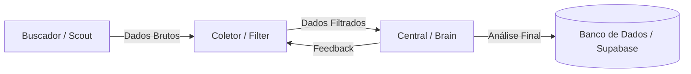

# Arquitetura de Agentes Especializados: A Tríade

Esta documentação descreve a nova estrutura de inteligência do **Detector de Promessa Vazia**, evoluindo de uma entrada manual para um sistema autônomo de coleta e análise.

## 1. Visão Geral

O sistema é composto por três agentes independentes que colaboram em um pipeline de dados:

---

## 2. Os Agentes

### 2.1. Agente Buscador (Scout)
*   **Objetivo:** Monitorar a web em busca de menções a políticos e novos discursos.
*   **Fontes:** Google News RSS, Portais de Notícias, APIs de Busca (Serper/Pollinations).
*   **Saída:** Lista de URLs, snippets de texto e metadados (data, fonte).

### 2.2. Agente Coletor (Filter)
*   **Objetivo:** Refinar o "ruído" capturado pelo Buscador.
*   **Funções:**
    *   Remover duplicatas (mesma notícia em sites diferentes).
    *   Classificar relevância: "Este texto contém uma promessa ou plano futuro?".
    *   Extrair o contexto exato da fala.
*   **Tecnologia:** Modelos de NLP leves (Compromise/Natural) + IA de baixo custo.

### 2.3. Agente Central (Brain)
*   **Objetivo:** A inteligência analítica e o aprendizado do sistema.
*   **Funções:**
    *   **Análise Profunda:** Extração detalhada via Gemini 1.5 Flash.
    *   **Cruzamento de Dados:** Verifica viabilidade no SICONFI e histórico no TSE.
    *   **Aprendizado:** Ajusta os pesos de confiança baseando-se em análises anteriores de sucesso/falha do mesmo político.
*   **Saída:** Score de Probabilidade final e Dossiê completo.

---

## 3. Fluxo de Dados Técnico

1.  **Trigger:** Um Job agendado (Cron) ou uma busca manual do usuário dispara o **Scout**.
2.  **Ingestão:** O **Scout** envia os dados para uma fila de processamento.
3.  **Refino:** O **Filter** limpa os dados e salva no `public_data_cache` com status `PENDING_ANALYSIS`.
4.  **Inteligência:** O **Brain** processa os itens pendentes, realiza o cruzamento orçamentário e atualiza o status para `ANALYZED`.
5.  **Entrega:** O Frontend consome os dados já processados do Supabase.

---

## 4. Benefícios da Nova Abordagem

*   **Escalabilidade:** Podemos adicionar novos buscadores (ex: para YouTube ou X) sem mexer na lógica de análise.
*   **Economia:** A IA cara (Brain) só processa o que a IA barata (Filter) já validou como útil.
*   **Precisão:** O sistema aprende com o histórico, tornando-se mais rigoroso com políticos que têm histórico de promessas não cumpridas.
