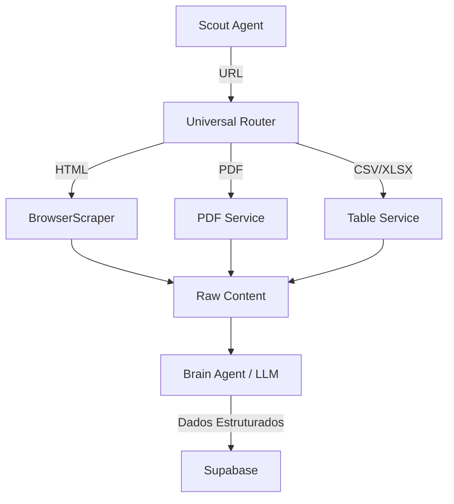

# 🕵️‍♂️ Proposta: Motor de Ingestão Universal (Seth VII)

Esta análise avalia a viabilidade do plano proposto pelo DeepSeek e propõe uma arquitetura otimizada para o **Seth VII**, focando em superar a limitação das APIs governamentais através da extração de dados não estruturados (Web, PDF, MD, etc.).

---

## ⚖️ Análise de Viabilidade (Plano DeepSeek)

O plano do DeepSeek é **altamente viável** e ataca o problema correto: a "cegueira" de dados causada por APIs limitadas. No entanto, para o contexto do Seth VII, proponho as seguintes melhorias:

### Pontos Fortes do Plano DeepSeek:
- **Foco em Formatos:** A detecção automática de PDF/HTML é essencial.
- **Arquitetura Modular:** Separar `crawlers` de `parsers` facilita a manutenção.
- **Custo Zero:** Uso de bibliotecas open-source (Playwright, Tesseract.js).

### Melhorias Propostas para o Seth VII:
1. **Inteligência de Extração (LLM-First):** Em vez de `parsers` rígidos para cada site, usar o **Brain Agent** para extrair dados estruturados de textos brutos extraídos de PDFs e HTMLs. Isso reduz o código de manutenção.
2. **Sistema de "Deep Scout":** Integrar o Agente de Ausência diretamente no pipeline de ingestão para buscar especificamente por editais e licitações quando uma promessa de obra é detectada.
3. **Cache de Snapshots:** Como já implementamos o `SnapshotService`, ele deve ser a base para armazenar os arquivos brutos (PDFs/HTMLs) antes do processamento.

---

## 🏗️ Arquitetura Sugerida: "Seth Ingestion Engine"

Proponho a criação de um novo diretório `server/ingestion/` com a seguinte lógica:

### 1. Router de Formato (Universal Router)
O `BrowserScraper` atual será expandido para detectar o `Content-Type` antes de processar.
- **HTML:** Segue o fluxo atual de limpeza.
- **PDF:** Encaminha para o `PDFParser` (usando `pdf-parse`).
- **CSV/XLSX:** Encaminha para o `TableParser`.

### 2. Pipeline de Processamento

---

## 🛠️ Plano de Implementação (Checkpoints)

### Checkpoint 10: Base de Ingestão Multi-Formato
- Instalar dependências: `pdf-parse`, `mammoth`, `xlsx`.
- Criar `server/services/ingestion.service.ts` para gerenciar o roteamento.
- Atualizar `BrowserScraper` para lidar com downloads de arquivos.

### Checkpoint 11: Integração com Diários Oficiais (DOU)
- Criar crawler específico para o IN.gov.br (DOU).
- Implementar parser de PDF para extrair atos de nomeação e editais.

### Checkpoint 12: Extração Semântica via IA
- Ajustar o `BrainAgent` para receber conteúdos brutos de documentos longos (PDFs) e realizar "chunking" (divisão em partes) para análise.

---

## 💰 Análise de Custos e Limites

| Recurso | Solução | Custo | Limite |
| :--- | :--- | :--- | :--- |
| **Processamento** | Railway / Sandbox | $0 | CPU/RAM do plano free |
| **Armazenamento** | Supabase Storage | $0 | 1GB (Suficiente para ~10k PDFs) |
| **OCR** | Tesseract.js | $0 | Execução local (CPU intensive) |
| **IA (Análise)** | Pollinations / OpenRouter | $0 | Rate limits das APIs |

---

## 🏁 Conclusão e Recomendação

A expansão para fontes não estruturadas é o **próximo salto evolutivo** do Seth VII. Ela permitirá que o sistema audite não apenas o que o governo "quer mostrar" via API, mas o que ele "publica por obrigação" em Diários Oficiais e editais.

**Recomendação Imediata:**
1. Começar pela implementação do **Parser de PDF** (DOU e Editais).
2. Integrar o **Scout** para buscar em portais de transparência estaduais que não possuem API.

Deseja que eu comece a implementação do **Checkpoint 10 (Base de Ingestão Multi-Formato)** agora?
